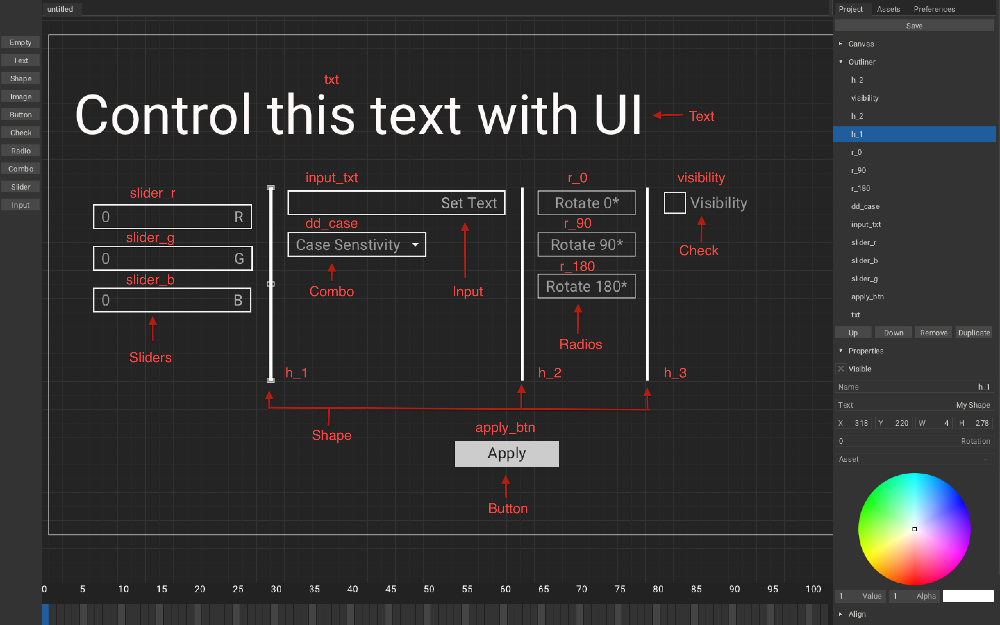

# Canvas
In this tutorial, we will learn about canvas and how to use it.

Including:
1. Add UI using Armory2D.
2. Controll it using Haxe.

Canvas parses `root/Bundled/canvas/nameOfCanvas.json`(produced by Armory2D) file's content and then [ZUI](https://github.com/armory3d/zui) will build UI from it. So it is possible to provide your own without using Armory2D but we will not do that here, we will only use it for editing.

---
Fire Armory3D project, once you have it up, go to `Scene - Armory Scene Trait`, create new `Canvas Trait`, name it `UI` and hit `Edit Canvas`. A window named Armory2D should pop-up:

Let study its user interface:

1. This is where you can add elements from.
2. This is `Canvas`'s area, where you arrange for you window.
3. This is `Project` tab, where you configure you elements.
   1. `Save`: Saves the canvas.
   2. `Canvas`: Create new canvas with given name, width and height.
   3. `Outliner`: This is layer. You can press `Up`/`Down` to move it up/down the layer, `Remove` to remove the element, `Duplicate`, to duplicate. (Pretty obvious)
   4. `Properties`: Adjust visibility, name, text, transform, color of an selected element.
   5. `Align`: (WIP).
   6. `Anchor`: Anchor element to selected side.
   7. `Script`: This is used to handle event.
   8. `Timeline`: (WIP).
4. This is Timeline, used to animate elements, but currently it is WIP, so we will ignore it for now.

Let add few elements:
