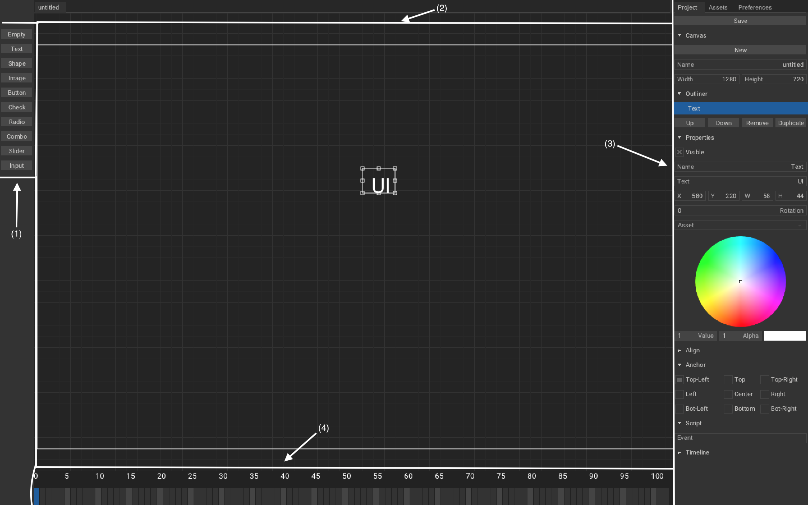

# Canvas
In this tutorial, we will learn about canvas and how to use it.

Including:
1. Add UI using Armory2D.
2. Controll it using Haxe.

Canvas parses `root/Bundled/canvas/nameOfCanvas.json`(produced by Armory2D) file's content and then [ZUI](https://github.com/armory3d/zui) will build UI from it. So it is possible to provide your own without using Armory2D but we will not do that here, we will only use it for editing.

---
Fire Armory3D project, once you have it up, go to `Scene - Armory Scene Trait`, create new `Canvas Trait`, name it `UI` and hit `Edit Canvas`. A window named Armory2D should pop-up:

Let study its user interface:

