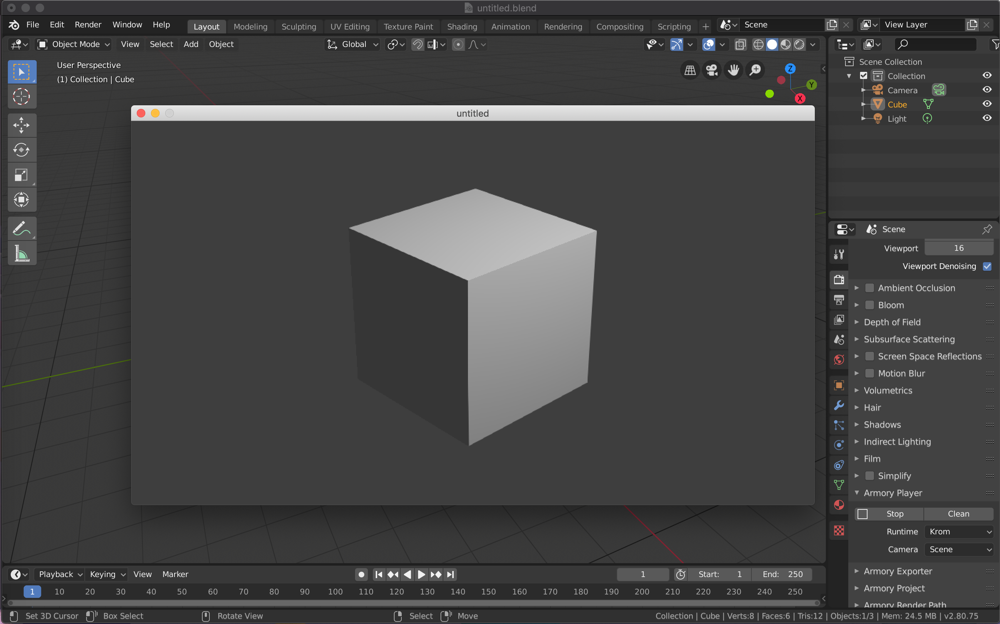

## Part I
In this part we will implement basic of file reading and writing from in-game. At the end of this part you should be able to save/write json to `Bundled` and then load/read json from `Bundled` both during in-game.

---

Let first open and save default cube blend file and in `Render - Armory Player` hit `Play`, a [Krom](https://github.com/Kode/Krom) window should pop-up showing our default cube. If it do then, celebrate! you have armory working!



Now, in `Scene - Armory Scene Traits` create a haxe trait with whatever name you want(`SaveLoadMechanism` in my case) and then hit `Edit Script`, now it should open [Kode Studio](https://github.com/Kode/KodeStudio) (if you have it install) or your system default IDE.

!> Note: Make sure to make your script's first letter to be capital


Now, for learning sake, we will be using [json](https://en.wikipedia.org/wiki/JSON) to store and read information from, later you can do stuff to make it unreadable to us humans to prevent cheating. [Haxe](https://haxe.org/) provide really good support for json and xml parsing and writing, making it easier for us to use.

```haxe
// In SaveLoadMechanism.hx

package arm;

class SaveLoadMechanism extends iron.Trait {
    public function new() {
        super();

        notifyOnInit(function() {

            #if kha_krom // 1
            var saveData = { text: "Hello World!" }; // 2
            var saveDataJSON = haxe.Json.stringify(saveData); // 3

            // will be saved at root_folder/build_file/debug/krom/my_file.json
            var path = Krom.getFilesLocation() + "/save_game.json"; // 4

            // Write file
            var bytes = haxe.io.Bytes.ofString(saveDataJSON); // 5
            Krom.fileSaveBytes(path, bytes.getData()); // 6
            #end
        });

    }
}
```
Let go and understand the code line-by-line:
1. This is `guard`, it will tell [Kha](https://github.com/Kode/Kha) to use code(in-between guard) when guard's condition is met, here it will tell Kha to save our file only if the target the game is running on is Krom. We are using it here so that the game will not cause any errors because we are using target specific function in our code `// 6`
2. Here variable `saveData` have little json structure defined, it only have `text: Hello World!` for now, we will add more as we go.
3. haxe.Json.stringify will convert our json structure to string json for saving to file.
4. Krom.getFilesLocation() will get path of build folder and add `"/save_game.json"` to it for complete path.
5. This will take our `saveDataJSON` string and than it will write it to bytes to save.
6. Krom.fileSaveBytes(path, bytes.getData()); will save bytes to path specified.

Now, hit `Play` and when you go over to `root_folder/build_file/debug/krom/` you should find `save_game.json` and on opening it should read `{"text":"Hello World!"}`, if you do, then Congratulation! You did it!


Now, let save `save_game.json` to proper place and add some keyboard input code to handle saving manualy instead of saving when the game initiate.

```haxe
// In SaveLoadMechanism.hx

package arm;

import iron.system.Input;// 1

class SaveLoadMechanism extends iron.Trait {

    var kb = Input.getKeyboard();// 1

	public function new() {
		super();

        notifyOnUpdate(function() { // 2
            if(kb.started("f")){ // 3
                save();
            }
        });
	}
    // 4
    public function save(){
        #if kha_krom
        var saveData = { text: "Hello World!" };
        var saveDataJSON = haxe.Json.stringify(saveData);

        // will be saved at file_write/build_file/debug/krom/my_file.json
        var path = Krom.getFilesLocation() + "/../../../" + "/Bundled/save_game.json";// 5

        // Write file
        var bytes = haxe.io.Bytes.ofString(saveDataJSON);
        Krom.fileSaveBytes(path, bytes.getData());
        trace("Saved!");
        #end
    }
}
```
1. We import and initialize keyboard input variable.
2. We change remove `notifyOnInit` and use `notifyOnUpdate` instead.
3. This check if keyboard key `f` is started, if so then it will call the save function.
4. We move all save functionality to it own function `save()`.
5. Here, we get out of build files and get bundled path, this will help us in reading the `save_game.json` later (`/..` means out of a directory).
Now, if you play and press `f` then it should save `save_game.json` to Bundled.


!> Don't forget to create Bundled folder in your root directory!

We will now add reading functionality, we will read `save_game.json` from `Bundled` folder and print `text` value in debug console. To enable debug console for debugging(ofc!), head over to `Render - Armory Project - Flags` and select `Debug Console`.


Now let get to code:
```haxe
// In SaveLoadMechanism.hx

package arm;

import iron.system.Input;
import iron.data.Data;//<===

class SaveLoadMechanism extends iron.Trait {
    
    var kb = Input.getKeyboard();//<===

    var saveFile = "save_game.json";//<===

	public function new() {
		super();

		notifyOnUpdate(function() {
            if(kb.started("f")){
                save();
            }else if(kb.started("g")){// 1
                load();
            }
		});
	}

    public function save(){
        #if kha_krom
        var saveData = { text: "Hello World!" };
        var saveDataJSON = haxe.Json.stringify(saveData);

        // will be saved at file_write/build_file/debug/krom/my_file.json
        var path = Krom.getFilesLocation() + "/../../../" + "/Bundled/save_game.json";

        // Write file
        var bytes = haxe.io.Bytes.ofString(saveDataJSON);
        Krom.fileSaveBytes(path, bytes.getData());
        trace("Saved!");
        #end
    }
    // 2
    public function load(){
        Data.getBlob(saveFile, function(bytes:kha.Blob) {// 3
            var jsonString = bytes.toString();// 4

            // Get json from string
            var json = haxe.Json.parse(jsonString);// 5
            trace(json.text);// 6
        });
    }
}
```
1. We add key check for load function too.
2. Create `load()` function.
3. Data.getBlob(`*file name*`, `*function*`) will get `*file name*` from Bundled folder and then do `*function*`.
4. We convert loaded bytes to string and assign it to `jsonString`
5. Parse json from `jsonString`
6. We finally print/trace `text` from json

Hit `Play`, try pressing `f` and then `g`, `Hello World!` should appear in debug console, if it do than that means saving and loading work perfectly!


And that is for today! In next part we will make it save cube's Location and Rotation.